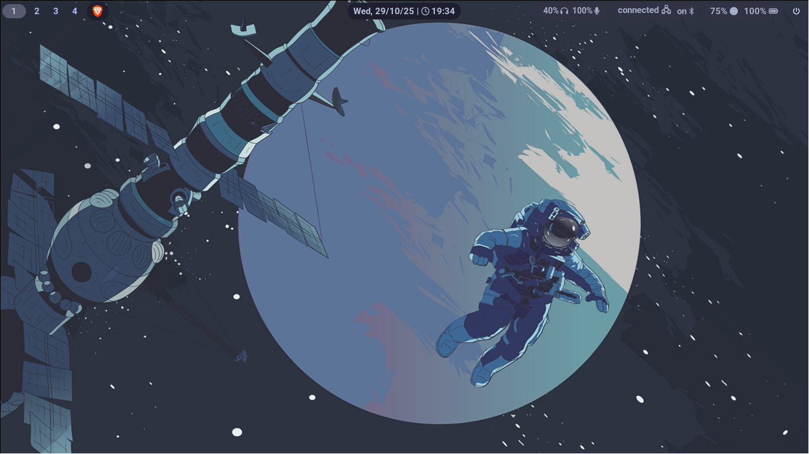
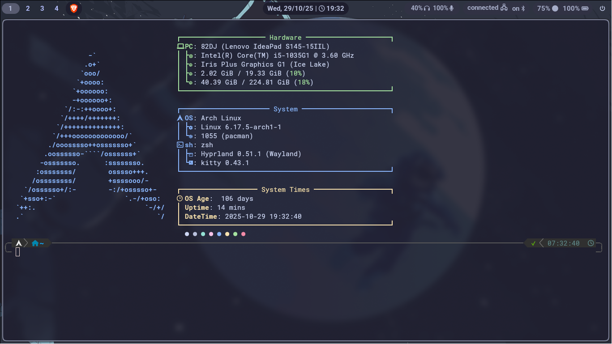
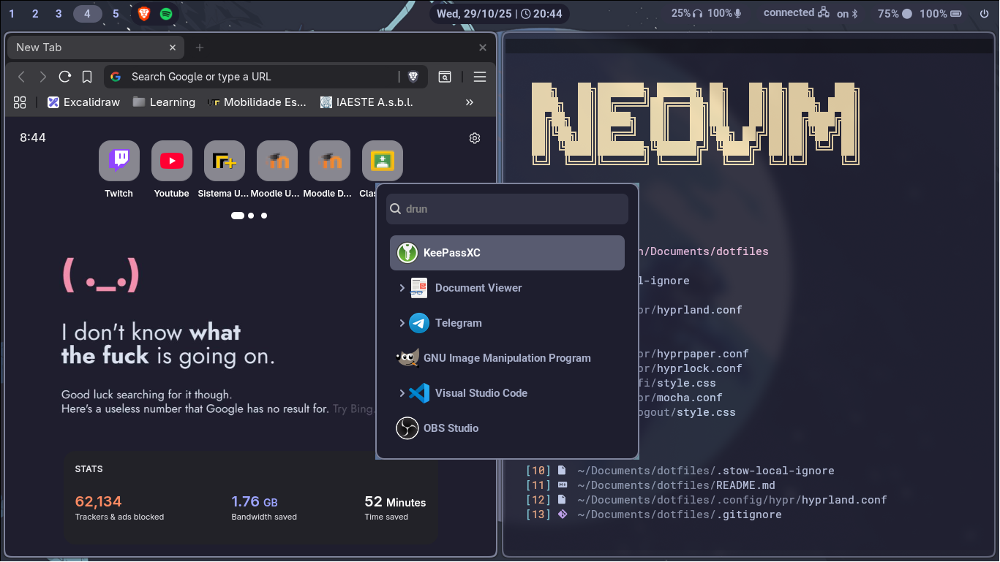

<h1 align="center">Dotfiles</h1>

This repository contains most of my personal dotfiles and configuration files for my Linux setup (Arch btw).

 
 
 

## Directory Structure

- **.zshrc** — Zsh shell configuration
- **wallpaper/** — Wallpapers used across the setup
- **grub/** — GRUB theme and wallpaper
- **sddm/** — SDDM login screen theme
- **.config/** — Application and environment configurations:
    - **fastfetch/** — System information display setup
    - **hypr/** — Hyprland window manager and module configs
    - **kitty/** — Kitty terminal configuration
    - **scooter/** — Scooter configuration
    - **waybar/** — Waybar status bar configuration
    - **wlogout/** — Logout menu configuration
    - **wofi/** — Wofi launcher configuration
    - **yazi/** — Yazi terminal file manager configuration

### Neovim Configuration
---

My Neovim configuration isn’t included here since it has its own repository.
 
Feel free to [check it out here.](https://github.com/AleMenon/nvim-config) 

## Tools and Environment

- **OS**: Arch Linux
- **WM**: Hyprland
- **Terminal**: Kitty
- **Launcher**: Wofi
- **Bar**: Waybar
- **File Manager**: Yazi
- **Login Manager**: SDDM

## Notes

These dotfiles are customized for my personal workflow and setup, and were inspired by many other configurations I've found.
 
Feel free to explore or adapt parts of it for your own configuration.
